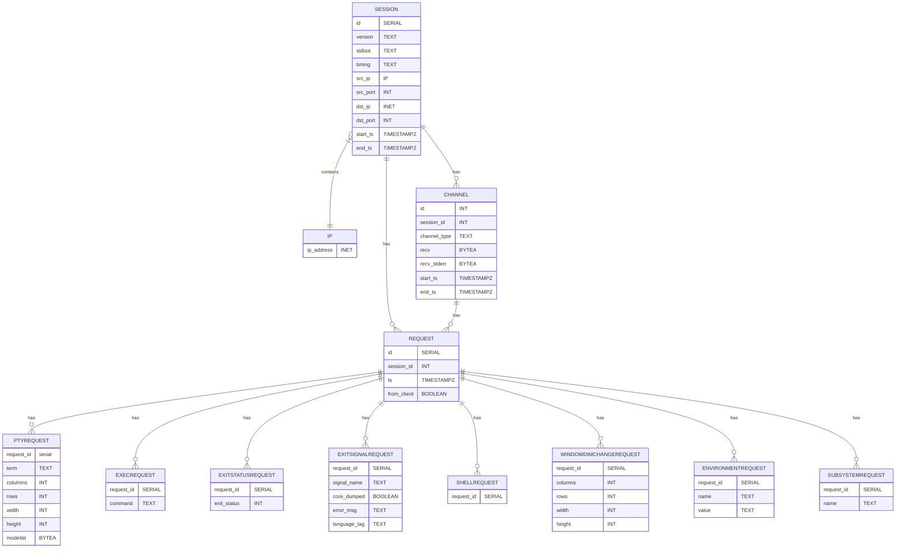

# Botpot

Botpot is an interactive SSH honeypot that supports all requests defined in [RFC 4254](https://www.rfc-editor.org/rfc/rfc4254). 
It works by acting as a proxy between the attacker-initiated SSH connection and a Docker container, 
parsing all the data sent between the two connections. When either the Docker container or the attacker 
disconnects, the session data is saved in a PostgreSQL database.

**NOTE:** The project is in active development and changes to the database may occur

## Features

- Supports all SSH requests defined in [RFC 4254](https://www.rfc-editor.org/rfc/rfc4254)
- Does not do any emulation, making it indistinguishable from a real SSH connection
- Keeps a buffer of honeypot containers running, minimizing delay for attackers
- Logs all data collected during the session and saves it in a PostgreSQL database
- Provides visualizations of the collected data through Grafana.
- Built on top of a [distroless image](https://github.com/GoogleContainerTools/distroless)

## Sequence Diagram

## Database ER Diagram

